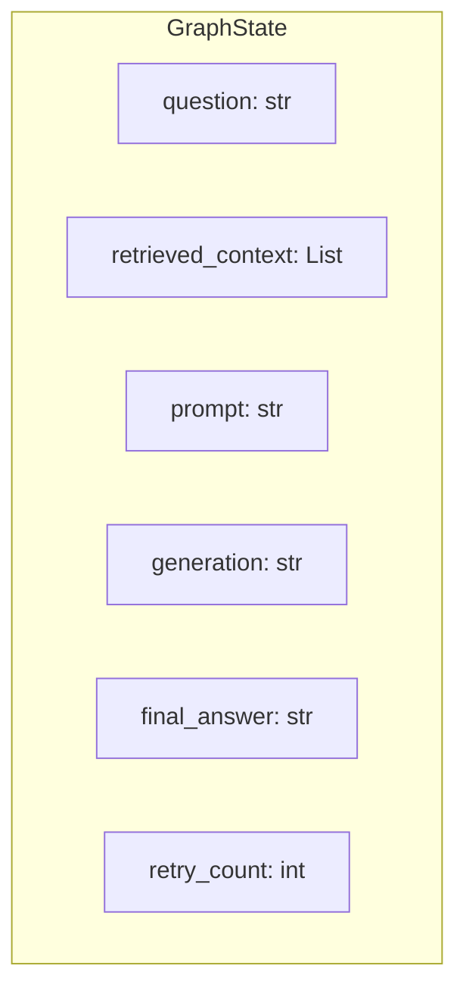

# 🚀 LLM DSL Information Extraction System - Guide Visuel Complet

> *Un système sophistiqué d'analyse et d'interrogation de code DSL utilisant l'IA sémantique et des workflows graphiques*

---

## 🎯 Vue d'ensemble

Ce projet est un **système intelligent d'extraction d'informations** pour interroger des codebases DSL (Domain-Specific Language), optimisé pour **Envision DSL de Lokad**. Il combine la recherche vectorielle (RAG) avec des agents IA multiples orchestrés par LangGraph.

---

## 🏗️ Architecture Globale du Système


### Composants Principaux

| Composant | Rôle | Fichier Clé |
|-----------|------|-------------|
| **Router** | Classifie les requêtes (GREP vs RAG) | [router.py](file:///home/kpihx/Work/AI/llm-DSL-info-extraction0/rag/router.py) |
| **RAG Pipeline** | Parse, chunke, embedde et recherche | [rag/](file:///home/kpihx/Work/AI/llm-DSL-info-extraction0/rag) |
| **LangGraph Workflow** | Orchestre le flux Question→Réponse | [langgraph_base.py](file:///home/kpihx/Work/AI/llm-DSL-info-extraction0/langgraph_base.py) |
| **Agents IA** | GPT-4, Gemini, Mistral, Groq | [agents/](file:///home/kpihx/Work/AI/llm-DSL-info-extraction0/agents) |

---

## 🔄 Pipeline RAG (Retrieval Augmented Generation)


### Étapes du Pipeline RAG

````carousel
### 1️⃣ EnvisionParser
Parse les fichiers `.nvn` et extrait des **blocs de code sémantiques**:
- **Comment Blocks** : Documentation `///`
- **Read Statements** : Ingestion de données
- **Table Definitions** : Définitions de tables
- **Assignments** : Calculs et affectations
- **Show Statements** : Visualisations

```python
# Exemple de parsing
parser = EnvisionParser(config)
code_blocks = parser.parse_file("script.nvn")
```
<!-- slide -->
### 2️⃣ SemanticChunker
Groupe les blocs de code en **chunks cohérents**:
- Préserve les frontières fonctionnelles
- Groupe par section logique
- Estime les tokens (max 512)
- Génère des métadonnées contextuelles

```python
chunker = SemanticChunker(config)
chunks = chunker.chunk_blocks(code_blocks)
```
<!-- slide -->
### 3️⃣ SentenceTransformerEmbedder
Transforme les chunks en **vecteurs 384D**:
- Modèle: `all-MiniLM-L6-v2`
- Normalisation des embeddings
- Support batch processing

```python
embedder = SentenceTransformerEmbedder()
embeddings = embedder.embed(chunks)
```
<!-- slide -->
### 4️⃣ FAISSRetriever
**Recherche vectorielle rapide** avec FAISS:
- Index type: `IndexFlatIP` (cosine similarity)
- Support GPU acceleration
- Top-K configurable (défaut: 10)
- Seuil de similarité: 0.7

```python
retriever = FAISSRetriever(config)
results = retriever.search(query_embedding, top_k=5)
```
````

---

## 🕸️ Workflow LangGraph


### États du Graphe



### Nœuds Principaux

| Nœud | Fonction | Description |
|------|----------|-------------|
| **Router** | `classify()` | GREP pour syntaxique, RAG pour sémantique |
| **Retrieve** | `retrieve_documents()` | Recherche FAISS + contexte |
| **Engineer** | `engineer_prompt()` | Construit le prompt avec contexte |
| **Generate** | `generate_answer()` | Appelle le LLM choisi |
| **Logic Check** | `check_logic()` | Vérifie la cohérence, boucle si erreur |
| **Grade** | `grade_answer()` | Évalue par cosine similarity ou LLM-as-Judge |

> [!TIP]
> La **boucle de retry** (max 2 itérations) permet de corriger automatiquement les erreurs de logique dans la réponse générée.

---

## 📊 Transformation des Données


### Exemple de Transformation

```diff
# Fichier .nvn original
/// Section: Inventory
read "/data/items.csv" as Items
Items.Quantity = sum(Transactions.Qty)
show table "Stock" with Items.Id, Items.Quantity

# ↓ Après PARSING → Code Blocks
+ CodeBlock(type="comment", content="Section: Inventory")
+ CodeBlock(type="read", table="Items", source="/data/items.csv")
+ CodeBlock(type="assignment", target="Items.Quantity")
+ CodeBlock(type="show", viz_type="table", name="Stock")

# ↓ Après CHUNKING → Semantic Chunk
+ CodeChunk(
+     section="Inventory",
+     content="[combined blocks]",
+     context={"tables": ["Items", "Transactions"]},
+     token_count=45
+ )

# ↓ Après EMBEDDING → Vector
+ [0.021, -0.145, 0.389, ..., -0.088]  # 384 dimensions

# ↓ Après INDEXING → FAISS
+ Index position: 42, chunk_id: "inv_01"
```

---

## 🤖 Architecture Multi-Agents


### Agents Supportés

| Agent | Fichier | Caractéristiques |
|-------|---------|------------------|
| **GPT-4** | [gpt_agent.py](file:///home/kpihx/Work/AI/llm-DSL-info-extraction0/agents/gpt_agent.py) | Raisonnement puissant |
| **Gemini** | [gemini_agent.py](file:///home/kpihx/Work/AI/llm-DSL-info-extraction0/agents/gemini_agent.py) | Capacités multimodales |
| **Mistral** | [mistral_agent.py](file:///home/kpihx/Work/AI/llm-DSL-info-extraction0/agents/mistral_agent.py) | Efficacité open-source |
| **Groq** | [groq_agent.py](file:///home/kpihx/Work/AI/llm-DSL-info-extraction0/agents/groq_agent.py) | Inférence ultra-rapide |

### Interface Commune

```python
class BaseAgent(ABC):
    @abstractmethod
    def generate(self, prompt: str) -> str:
        """Génère une réponse à partir du prompt."""
        pass
```

> [!IMPORTANT]
> Le **rate limiting** est configurable dans `config.yaml` pour éviter les erreurs 429 des APIs.

---

## ⚙️ Configuration Clé

Extraits de [config.yaml](file:///home/kpihx/Work/AI/llm-DSL-info-extraction0/config.yaml):

```yaml
agent:
  default_model: "mistral"
  rate_limit_delay: 2  # secondes

rag:
  top_k_chunks: 5
  fusion: False

chunker:
  max_chunk_tokens: 512
  use_summary_embeddings: true

embedder:
  sentence_transformer:
    model_name: "all-MiniLM-L6-v2"

retriever:
  faiss:
    index_type: "IndexFlatIP"
    top_k: 10
    search_threshold: 0.7
```

---

## 📁 Structure du Projet

```text
llm-DSL-info-extraction/
├── 🎯 main.py                 # Point d'entrée principal
├── 🕸️ langgraph_base.py       # Définition du graphe LangGraph
├── ⚙️ config.yaml             # Configuration centralisée
│
├── 🤖 agents/                 # Agents IA
│   ├── base.py               # Interface abstraite
│   ├── gemini_agent.py
│   ├── gpt_agent.py
│   ├── mistral_agent.py
│   └── groq_agent.py
│
├── 🔄 rag/                    # Pipeline RAG
│   ├── core/                 # Classes de base
│   ├── parsers/              # EnvisionParser
│   ├── chunkers/             # SemanticChunker
│   ├── embedders/            # SentenceTransformer, OpenAI, Gemini
│   ├── retrievers/           # FAISS, GREP
│   └── router.py             # Classification des requêtes
│
└── 📊 pipeline/               # Workflows avancés
    ├── agent_workflow/       # Pipeline agentique
    └── benchmarks/           # Évaluation cosine similarity
```

---

## 🎮 Utilisation Rapide

```bash
# 1. Construire l'index FAISS
python build_index.py

# 2. Mode interactif
python main.py

# 3. Mode verbeux avec RAG Fusion
python main.py --verbose --fusion

# 4. Benchmark
python main.py --benchmark questions.json
```

---

## 🔑 Points Clés à Retenir

1. **Double stratégie de recherche** : GREP (syntaxique) + RAG (sémantique)
2. **Chunking sémantique** : Préserve la cohérence fonctionnelle du code
3. **Boucle de correction** : Retry automatique si erreur logique détectée
4. **Multi-agents** : Flexibilité pour utiliser différents LLMs
5. **Benchmarking intégré** : Évaluation par cosine similarity ou LLM-as-Judge
